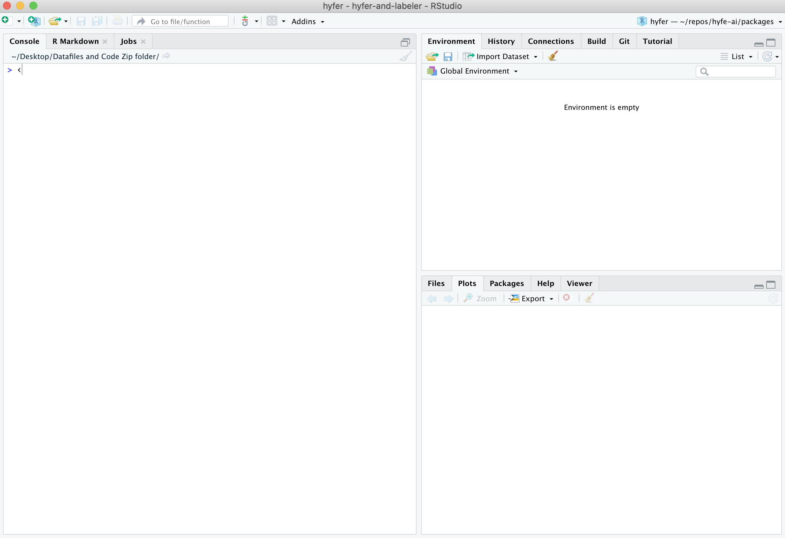

```{r setup, include=FALSE}
knitr::opts_chunk$set(echo = TRUE)
```

_Important: the below MUST be finished prior to the course starting. If you run into any obstacles, problems, etc., please contact joe@databrew.cc. Do NOT wait until the course has started to report problems._


# Setting up `RStudio`

First, let's get the right programs installed on your computer. Then we will explain what they are and why you need them.   


**First, download and install `R`:**   

Go to the following website, click the *Download* button, and follow the website's instructions from there.
[https://mirrors.nics.utk.edu/cran/](https://mirrors.nics.utk.edu/cran/){target="blank"}

&nbsp;

**Second, download and install `RStudio`:**    

Go to the following website and choose the free Desktop version:
[https://rstudio.com/products/rstudio/download/](https://rstudio.com/products/rstudio/download/){target="blank"}

&nbsp;

**Third, make sure `RStudio` opens successfully:**    

Open the `RStudio` app. A window should appear that looks like this:


&nbsp;

**Fourth, make sure `R` is running correctly in the background:**    

In `RStudio`, in the pane on the left (the "Console”), type 2+2 and hit Enter.  
If `R` is working properly, the number “4” will be printed in the next line down.

&nbsp;

**Finally, some minor adjustments to make `RStudio` run smoother (and look cooler):**

Go to `Tools > Global Options` and make sure your `General` settings match these exactly:


Specifically, **uncheck** the option under *Workspace* to 'Restore .RData into workspace at startup.'  

Now go to the `Appearance` settings and choose a cool theme!


**Finally, install some packages**

Copy-paste the following into the R console and run:

```{r, eval = FALSE}
install.packages('tidyverse')
```


