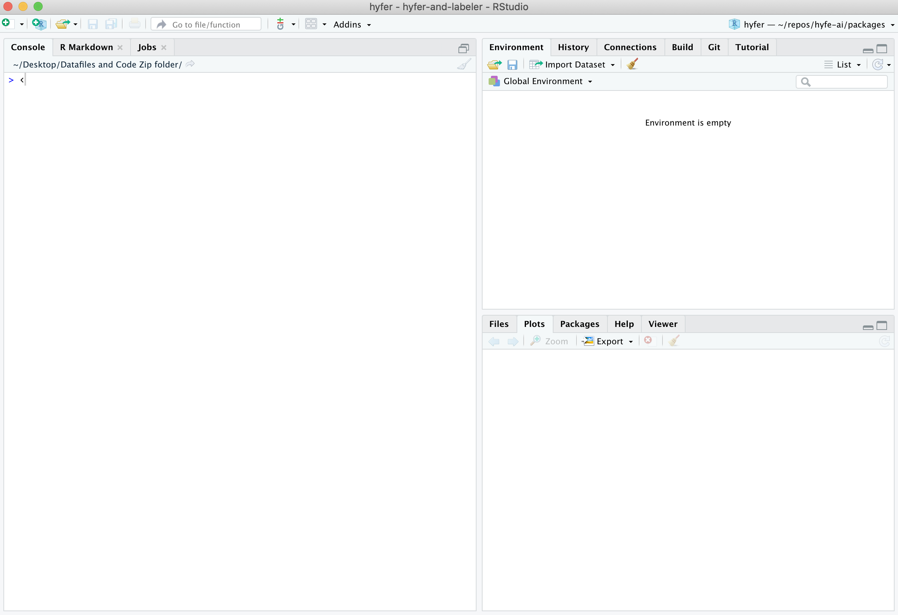
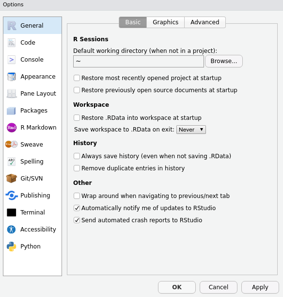
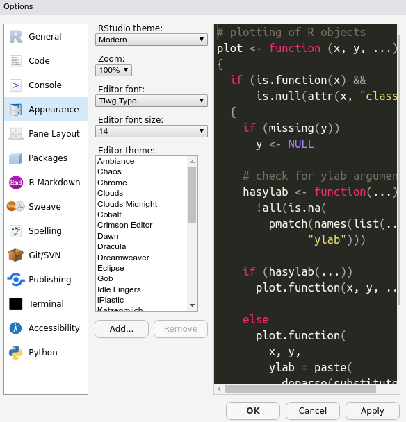

Getting set up
================

*Important: the below MUST be finished prior to the course starting. If
you run into any obstacles, problems, etc., please contact
<joe@databrew.cc>. Do NOT wait until the course has started to report
problems.*

# Setting up `RStudio`

First, let’s get the right programs installed on your computer. Then we
will explain what they are and why you need them.

**First, download and install `R`:**

Go to the following website, click the *Download* button, and follow the
website’s instructions from there. <https://mirrors.nics.utk.edu/cran/>

 

**Second, download and install `RStudio`:**

Go to the following website and choose the free Desktop version:
<https://rstudio.com/products/rstudio/download/>

 

**Third, make sure `RStudio` opens successfully:**

Open the `RStudio` app. A window should appear that looks like this:

  

**Fourth, make sure `R` is running correctly in the background:**

In `RStudio`, in the pane on the left (the “Console”), type 2+2 and hit
Enter.  
If `R` is working properly, the number “4” will be printed in the next
line down.

 

**Finally, some minor adjustments to make `RStudio` run smoother (and
look cooler):**

Go to `Tools > Global Options` and make sure your `General` settings
match these exactly:

 Specifically, **uncheck** the option under
*Workspace* to ‘Restore .RData into workspace at startup.’

Now go to the `Appearance` settings and choose a cool theme\!



**Finally, install some packages**

Copy-paste the following into the R console and run:

``` r
install.packages('tidyverse')
```
